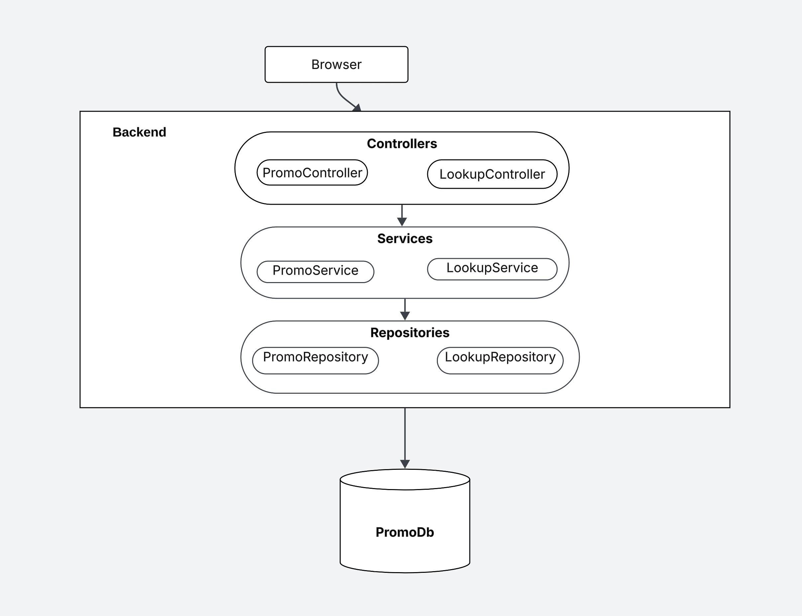

## 📝 Introduction

PromoManager is a lightweight, full-stack web application designed to manage product promotions efficiently across multiple stores and items. It enables businesses to:

- Create new promotions with defined items, stores, start, end dates, and tactics
- View all existing promotions in a structured tabular list
- Edit promotion details seamlessly as business requirements change
- Delete a promotions if needed
- Sort and filter promotions based on any column to quickly find relevant entries

This application is built with a clean architecture approach using:

- **Backend:** ASP.NET Core (C#) following MVC with Controller → Service → Repository pattern for scalability and maintainability
- **Database:** SQLite with a normalized schema supporting many-to-many relationships (items, stores, tactics)
- **Frontend:** React with Vite for rapid development and smooth user experience

## 🛠️ Technologies Used

| Layer     | Technology |
|-----------|------------|
| **Backend** | C# (.NET 8) |
|            | MVC with Controller → Service → Repository pattern |
|            | Testing: NUnit (Test-Driven Development) |
| **Database** | SQLite |
| **Frontend** | React + Vite + JavaScript + CSS |

---

## 🚀 Getting Started

### ✅ Prerequisites

- **Backend**
  - [.NET SDK (version 8)](https://dotnet.microsoft.com/download)
- **Frontend**
  - [Node.js (v18+ recommended)](https://nodejs.org/en/download)

---

## 🔧 Setup Instructions

### 1. Clone the Repository

```bash
git clone git@github.com:beautisui/PromoManager.git
cd PromoManager
```

---

### 2. Running the Backend

#### 📁 Navigate to backend project folder (if in subdirectory)

```bash
cd PromoManager
```

#### ⚙️ Restore packages

```bash
dotnet restore
```

#### ▶️ Run the backend

```bash
dotnet run
```
---

### 3. Setting up the Frontend

#### 🌱 Install Vite Template (If creating from scratch)

If you are creating a new frontend from scratch, run:

```bash
npm create vite@latest promo-frontend -- --template react
```

If you already have the frontend project, navigate to its folder:

```bash
cd PromoFrontend
```

Then install:

```bash
npm install
```

---

### 4. Running the Frontend

```bash
npm run dev
```

- This will start the frontend server at `http://localhost:5173` (default for Vite).

---

### 5. Backend API Endpoints

| **Path**                       | **Method** | **Description**                                                   | **Query Parameters**                     |
| ------------------------------ | ---------- | ----------------------------------------------------------------- | ---------------------------------------- |
| `/api/promotion`               | `GET`      | Retrieve all promotions with optional sorting                     | `sortBy`, `sortOrder`                    |
| `/api/promotion/filter`        | `GET`      | Filter promotions based on field and values with optional sorting | `field`, `values`, `sortBy`, `sortOrder` |
| `/api/promotion`               | `POST`     | Create a new promotion                                            | –                                        |
| `/api/promotion/{promoId}`          | `PATCH`    | Update an existing promotion                                      | –                                        |
| `/api/promotion/{promoId}`          | `DELETE`   | Delete a promotion                                                | –                                        |
| `/api/lookup/items`            | `GET`      | Fetch list of items                                               | –                                        |
| `/api/lookup/stores`           | `GET`      | Fetch list of stores                                              | –                                        |
| `/api/lookup/tactics`          | `GET`      | Fetch list of tactics                                             | –                                        |
| `/api/lookup/availableOptions` | `GET`      | Fetch list of items, stores, tactics                              | –                                        |

---

## 📊 Promotions Database Design

### 🟦 Promo Table

| Column     | Example   |
|------------|-----------|
| PromoID    | 1         |
| StartDate  | 11-11-25  |
| EndDate    | 11-12-25  |
| TacticID   | 2         |

### 🟦 Store Table

| Column     | Example     |
|------------|-------------|
| StoreID    | 1           |
| StoreName  | Store 1     |

### 🟦 Item Table

| Column     | Example   |
|------------|-----------|
| ItemID     | 1         |
| ItemName   | Pen       |

### 🟦 Tactic Table

| Column  | TacticType |
|---------|------------|
| 1       | 25% off    |
| 2       | 1$ off     |
| 3       | BOGO Free  |

### 🟦 PromoStore Table (Many-to-Many)

| PromoID | StoreID |
|---------|---------|
| 1       | 2       |

### 🟦 PromoItem Table (Many-to-Many)

| PromoID | ItemID |
|---------|--------|
| 1       | 1      |

---

## 🔄 Promo Creation Flow

1. **Frontend** sends data to backend:
    ```json
    {
      "itemIds": [1, 2, 3],
      "storeIds": [2, 4],
      "startDate": "2025-06-20T00:00:00",
      "endDate": "2025-06-30T00:00:00",
      "tacticId": 3
    }
    ```

2. **Backend** stores normalized data in:
    - Promotions table
    - PromoItem and PromoStore linking tables

3. **Frontend** displays data in nested JSON format:

    ```json
    [
      {
        "promoId": 1,
        "items": [
          { "id": 1, "name": "Pen" },
          { "id": 2, "name": "Pencil" }
        ],
        "stores": [
          { "id": 1, "name": "store1" },
          { "id": 2, "name": "store2" }
        ],
        "startTime": "2025-06-20",
        "endTime": "2025-06-30",
        "tactic": [
          { "tacticId": 1, "tactic": "BOGO Free" }
        ]
      }
    ]
    ```

---

# 📊 Promotion Manager - Acceptance Criteria

This document compiles all acceptance criteria for the key promotion features.

---

## ✅ 1. View All Promotions in List View

### **Acceptance Criteria**

1. Display a list view of all promotions.
2. List of columns:
    - **Promo ID**
    - **Items** (a promotion can have multiple items)
    - **Stores** (a promotion can have multiple stores)
    - **Start date**
    - **End date**
    - **Tactic**
    - **Action** (Edit, Delete)
3. Default sorting to be done by **Promo ID (Descending)**.
4. Sorting and filtering to be supported for each column.

---

## ✅ 2. Create a New Promotion

### **Acceptance Criteria**

1. An icon to launch the **Create popup**.
2. Provide fields to capture below details:

    - **Item** (Multi select, Dropdown with 10 items listed):
        - Pencil
        - Eraser
        - Sharpener
        - Pen
        - Notebook
        - Ruler
        - Crayon
        - Glue stick
        - Scissors
        - Pencil box

    - **Store** (Dropdown with 6 stores listed):
        - Store 1
        - Store 2
        - Store 3
        - Store 4
        - Store 5
        - Store 6

---

## ✅ 3. Update an Existing Promotion

### **Acceptance Criteria**

1. Provide an option to edit a promotion from **List view**.
2. Upon selecting the edit option, open the Promotion details screen with below details:
    - **Promo ID** (Read only)
    - **Item**
    - **Store**
    - **Start date**
    - **End date**
    - **Tactic**
3. Existing values to be **pre-populated**.
4. User can **modify** the values as needed against each field.
5. Upon making any change, users should be able to **Save** them. Otherwise, the button should be **greyed out**.
6. Users can **discard** the changes by clicking on **Cancel** and get back to List view.

---

## ✅ 4. Delete an Existing Promotion

### **Acceptance Criteria**

1. Provide an option to delete a promotion from **List view**.
2. Upon clicking the delete icon, users should see a **confirmation popup**, which reads:

   > "Are you sure to delete the selected promotion?"

3. Users should be able to see two options in the popup:
    - **Yes** – clicking which should delete the promotion and return to list view.
    - **No** – closes the popup and returns to list view.

---

## 🔮 Future Enhancements

- User authentication and authorization


## Promotions Application Architecture Diagram



---